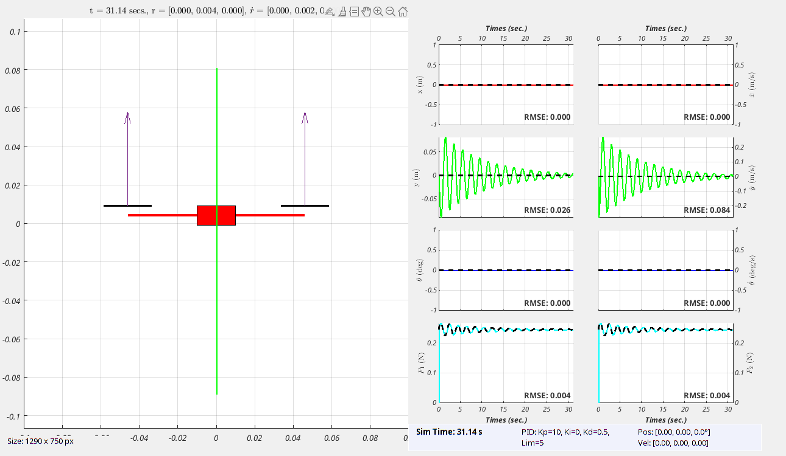
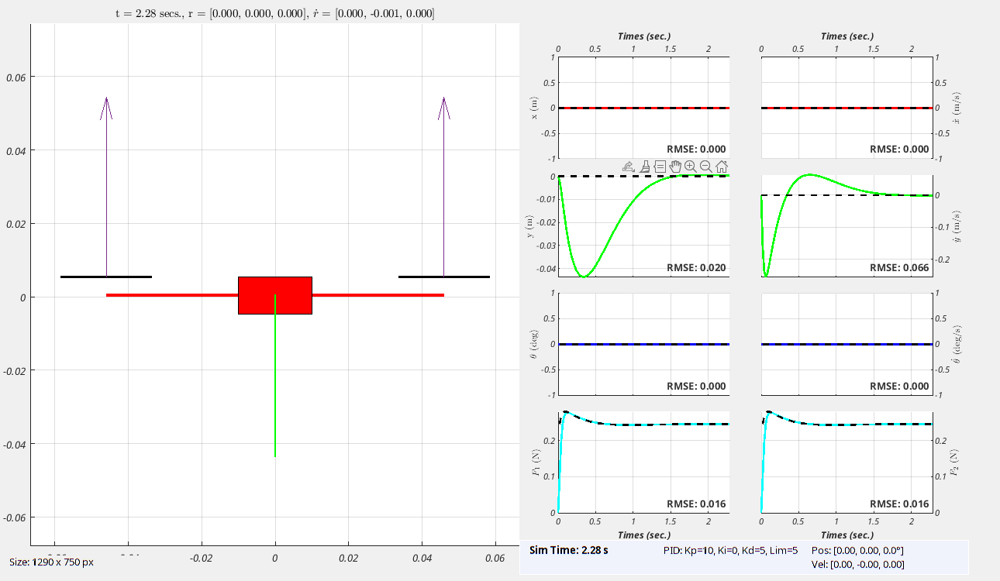
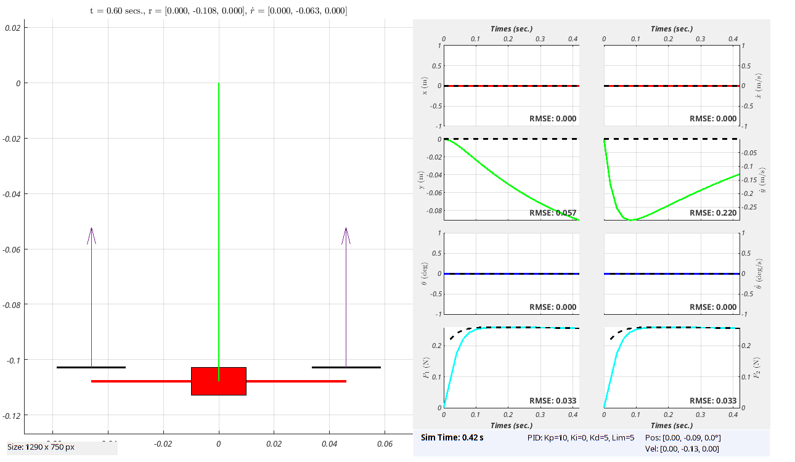
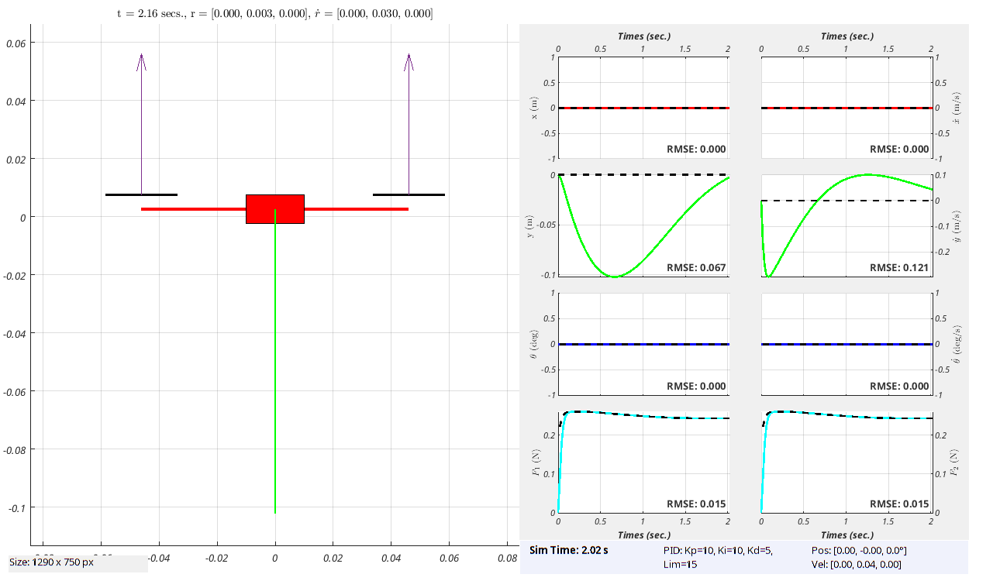
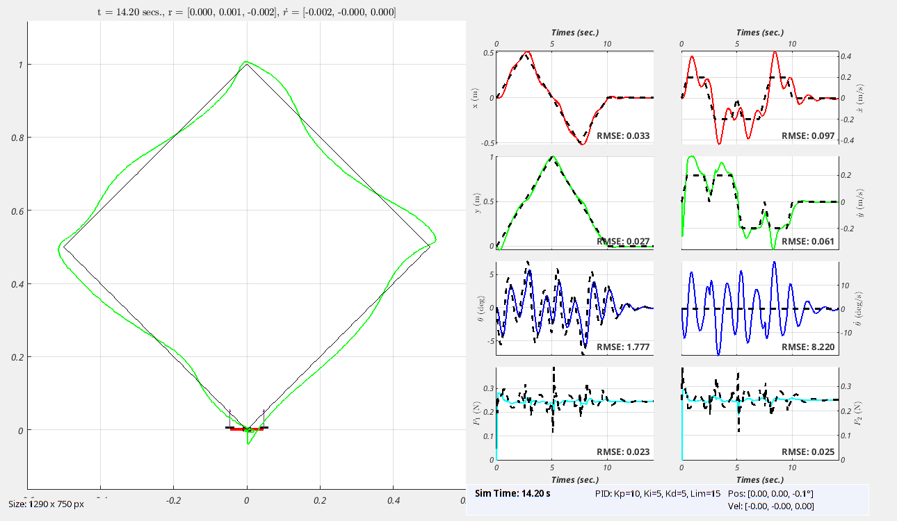
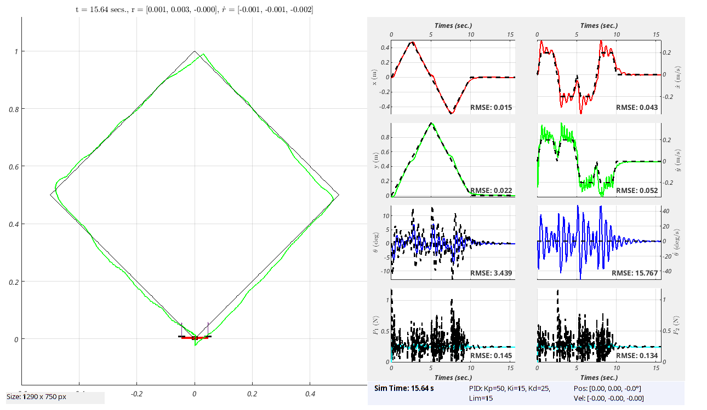
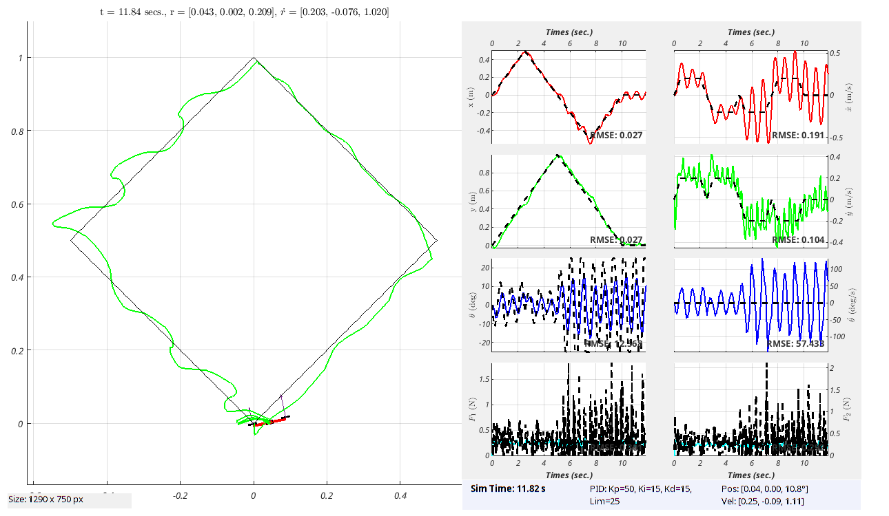

# MAVES: MATLAB Aerial Vehicle Educational Simulator

MAVES is a MATLAB-based, planar vertical take-off and landing (VTOL) sandbox that lets students design guidance and control algorithms for a quadcopter.  
The `matlab/runsim.m` script wires together the core simulator, helper utilities, and either the provided starter code or an instructor solution before looping the physics and visualization updates that drive the experience.

## Repository layout
- `matlab/core` – physics, state management, and visualization routines that initialize the simulator, integrate the dynamics, and update plots each frame.
- `matlab/utils` – helper utilities for registering controllers, selecting arenas, and querying simulator parameters from anywhere in the workspace.
- `matlab/studentCode` – templates where learners implement their controller and trajectory generators, ready to be activated from `runsim` for testing.
- `matlab/soln` – a worked solution set that demonstrates one possible implementation of the required logic.
- `matlab/arenas` – text-based arena descriptions that constrain the vehicle’s motion and obstacle layout.

## Running the simulator
1. Open MATLAB and `cd` into the `matlab` folder.  
2. Choose the implementation you want to exercise by setting `activeSolution` to either `'student'` or `'solution'` near the top of `runsim.m`; the script manages the MATLAB path so that only the selected submission is active.  
3. Pick a trajectory generator by calling `setTrajectoryGenerator` with the handle and parameters you want. Sample calls are provided for hovering, line, diamond, and circular paths.  
4. Register your controller with `setController(@controller)`; the default starter template simply returns zeros until you flesh it out.  
5. Run the script. The main loop advances the dynamics, updates the visualization, and sleeps to maintain the configured simulation rate until the vehicle either completes its task or leaves the arena.  
   Use `setVisualizationMode('deferred')` if you prefer to run the physics as quickly as possible and only draw the final plots after the simulation stops; the default `'live'` mode keeps the original frame-by-frame updates.  
   Enable capture with `setCaptureMode('save')` to record the arena figure while you run the simulation. In live mode this writes `maves_video_<timestamp>.mp4`; in deferred mode the final frame is exported as `maves_image_<timestamp>.png`. Use `'none'` to leave nothing behind.

## How the simulation works
- **Initialization pipeline.** `initialize()` orchestrates parameter setup, arena configuration, state resets, and plot creation before every run.  
- **Physics stepping.** Each call to `updatePhysics()` pulls the active trajectory generator and controller, integrates the coupled rigid-body and motor dynamics with `ode45`, and writes the updated state back to the simulator database.  
- **Status monitoring.** `checkStatus()` stops the simulation if the quadcopter exits the arena, collides, or successfully hovers at the goal position, using the arena limits and recent motion history to decide.  
- **Arena management.** `setArena()` looks up arena definitions in `matlab/arenas`, and helpers like `getArenaLimits()` expose the configured boundaries to controllers and monitors.

## Extending MAVES
- Implement new controllers by editing `matlab/studentCode/controller.m`. Use utilities such as `evalTrajectory`, `evalControl`, and `getStateVector` to compute thrust and attitude commands that stabilize your vehicle.  
- Design alternative reference motions in the trajectory templates (hover, line, diamond, circle) or add new generator functions that follow the same signature used by `setTrajectoryGenerator`.  
- Customize testing scenarios by supplying additional arena files under `matlab/arenas` and selecting them via `setArena('name')`. Controllers can query the current limits with `getArenaLimits()` to stay inside the course.

With these building blocks, MAVES provides a compact environment for experimenting with VTOL guidance, navigation, and control strategies entirely within MATLAB.

## Simulation Gallery

The following examples illustrate MAVES in action under different trajectory and controller configurations.  
Each scenario demonstrates how controller tuning, trajectory design, and vehicle parameters influence VTOL behavior.

### Hover Control
| Case | Description | Preview |
|------|--------------|----------|
| **Hover-01** | Aggressive proportional gain with minimal damping. The vehicle overshoots the target altitude before settling. |  |
| **Hover-02** | Increased derivative gain yields smooth exponential convergence to the setpoint. |  |
| **Hover-03** | Controller mass underestimated by 10 %; steady-state error remains. |  |
| **Hover-04** | Integral action compensates the bias, eliminating steady-state error. |  |

### Diamond Trajectory Tracking
| Case | Description | Preview |
|------|--------------|----------|
| **Diamond-01** | Moderate PID gains produce noticeable steady-state error during path tracking. |  |
| **Diamond-02** | PD gains increased fivefold improve trajectory adherence but raise control effort. |  |
| **Diamond-03** | Reduced derivative gain introduces oscillations and marginal stability. |  |

### Circular Trajectory (Video)

Circular trajectory tracking with the nominal PD controller.

https://github.com/user-attachments/assets/1b9610a2-6565-4ad8-ab6d-98f036cf52fa

Also on YouTube: https://youtu.be/9i_f6V2WODo
